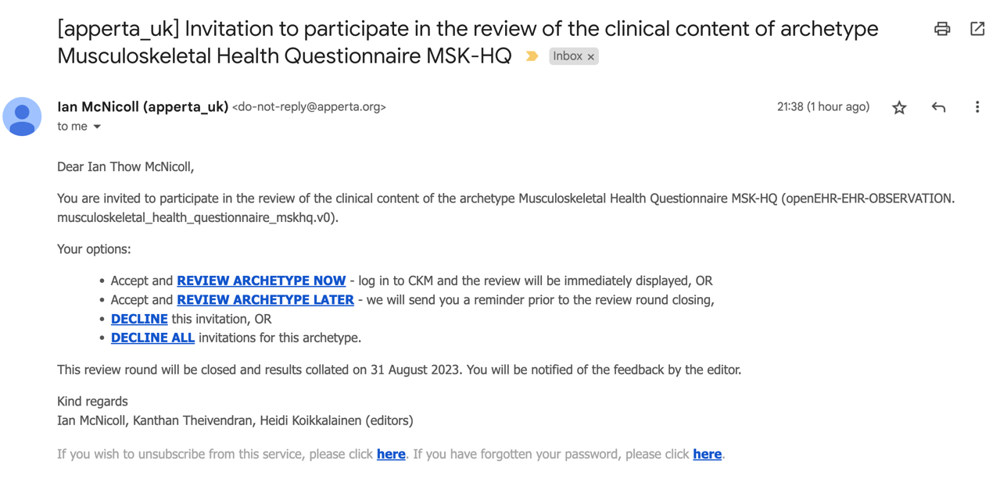
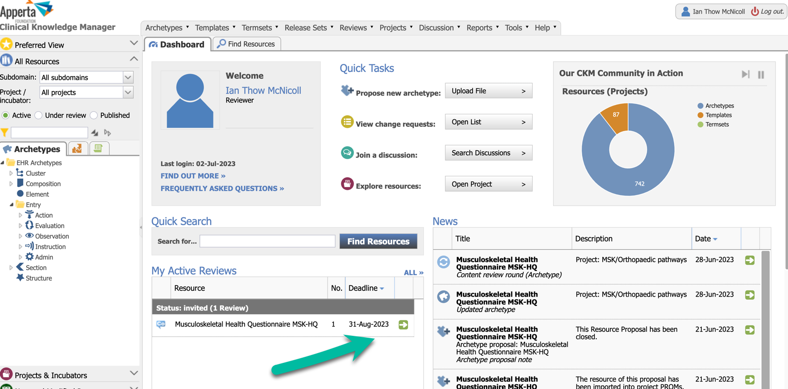
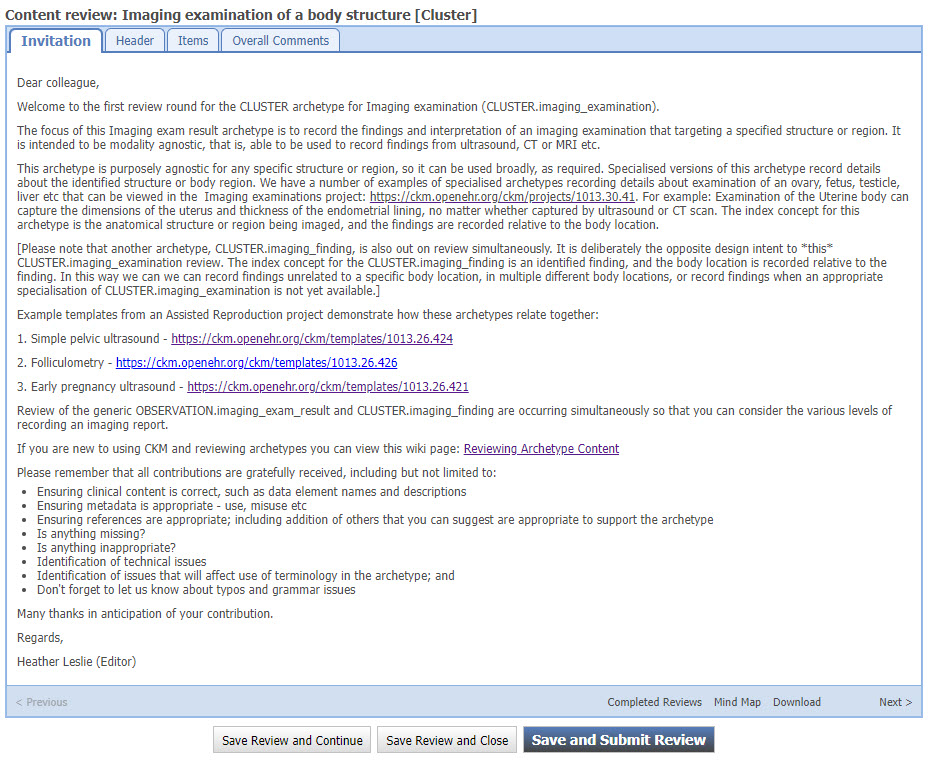

# Reviewing an Archetype on the Apperta CKM

!!! warning Acknowledgement

This page is adapted from the original 'Review Archetype content' openEHR wiki page created by Dr Heather Leslie at 

https://openehr.atlassian.net/wiki/spaces/healthmod/pages/2949148/Review+Archetype+Content

but which may not be accessed directly from within some embedded web pages.

## Registering as a reviewer

You must first have registered as an archetype reviewer with the Apperta MSK / Orthopaedic pathways project via the link in you introductory email, which will bring to a page like this

## Getting started with your archetype review

When the archetype review starts, you will receive an email invitation which you can use to start your review directly or you can visit the Apperta CKM Dashboard and start or continue your review from there

### A. Start your archetype review via the email invitation 

You will be invited to to participate in formal archetype reviews via an email, similar to the one below, stating the name of the archetype that will be reviewed. 

 

Choose one of the following options ...

#### Accept and Review archetype now:

This option will open the Clinical Knowledge Manager (CKM), ready for you to log in, and then display the editorial introductory comments for the review.  This is displayed on the front tab of a wizard which will progressively step you through all of the parts of the content review.

#### Accept and Review archetype later:

This option will notify the editor of your acceptance, and you will be able to log in to CKM and complete the review at your convenience. 

#### Decline the invitation:

This option will notify the editor that you are not able to participate in the review.

#### Decline all invitations for this archetype:

This option will notify the editor that you are not able to participate in the review, and block any subsequent review invitations for this particular archetype.

The due date for completion of the review is also displayed.

The first option  - '**Review Archetype Now**' is clearly the easiest way to get access to the archetype review.  

However, you may also access the archetype review directly from within the Apperta CKM...

### B. Start the archetype review via Apperta CKM

The Apperta CKM is at  https://ckm.apperta.org 

Login and locate your Dashboard tab.

Within the Dashboard will be a panel called **'My Active Reviews'**.

Click on the green arrow next to the archetype invitation
Select 'Start Your Review' to initiate the review.

## Providing review feedback
The review is presented in a wizard format - tabs containing the content linked together by a 'Next' button.

### 1. Introductory screen
On successful initiation of the review the introductory comments from the Editor will be presented to provide context for the review, and in subsequent review rounds, the collated feedback from the previous review (in the blank space below the introductory message).  See below. 

From this screen it is also possible to:

- View already completed reviews from other reviewers in the current or any previous review rounds.
- Display a mindmap view of the archetype
- Download the archetype onto your computer
- During the review it may be useful to refer to the Archetype Checklist for further guidance.

Navigate to the next topic in the review by clicking on the `Next` button.

### 2. Subsequent Screens

You can see that the active tab is now the second tab labeled `Header`.  This will enable the user to provide feedback about each element of the header. 

Add the comments into the text box labelled `Your comment:`.

Once you have completed all the Header-related comments, clicking on the `Next` button will take you progressively through each tab, or page, in the review.  

In this example, Data, State, Protocol, and Events make up the components of the archetype. 

The `Reference model` tab is only intended to inform the reviewers of the standard elements that are inherited from the reference model to the archetype, and can't be commented. 

The `Overall comments` section enables broader feedback about the archetype as a whole. 

You can always `Save` the review at any stage, without having to complete every topic. 

To submit the review as final, the `Overall recommendation` element in the 'Overall comments' tab has to be completed.

