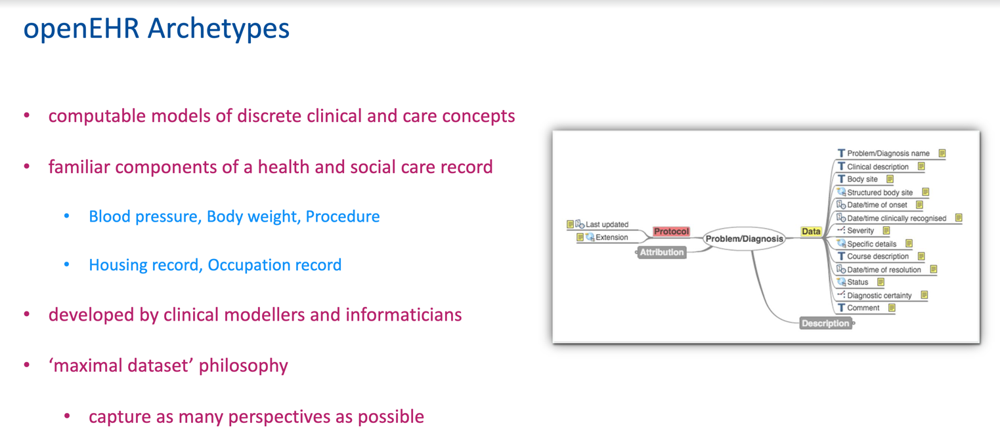
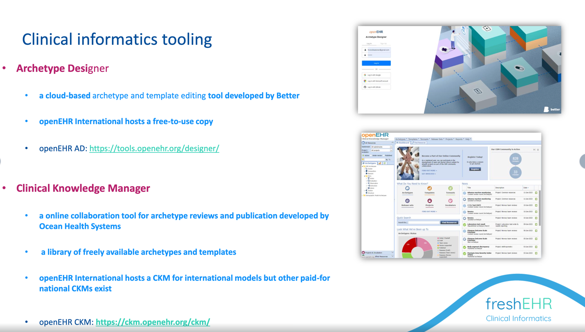

# Apperta MSK / Orthopaedic pathways

## Introduction

This project aims to build and publish a number of openEHR archetypes and templates, relating to the kind of clinical and patient-recorded information associated with a typical MSK/ Orthopaedic pathway/journey, and used for example in the [openOutcomes application].

The initial focus will be on PROMS (Patient Recorded Outcome Measures), with the ultimate aim of having these re-published by openEHR International.

## openEHR archetypes and templates

For those not familiar with openEHR, this [short introductory video](https://youtu.be/uWBAeu464rM?t=62) may be helpful - watch until about 15m 20s.

Archetypes are definitions of components of information to be stored in a healthcare record or application. For example how to record a blood pressure, or a diagnosis, or a specific PROM like EQ-5L.

The non-profit openEHR community works directly with clinicians and other health and care professionals to define and then freely share the archetypes and templates, using tools that non-engineers can use to create and review the archetypes.

## Reviewing archetypes

Building archetypes is normally done by clinical informatics but they need to be reviewed by sepecialists in the subject, in this case people with a knowledge of MSK and Orthopaedics pathways.

We use a special tool called 'Clinical Knowledge Manager' for this purpose, inviting people to review the archetype on-line.

The process is straightforward but you might find it helpful to watch this [walk-through of what is involved]().

This [Reviewing archetypes](https://openehr.atlassian.net/wiki/spaces/healthmod/pages/2949148/Review+Archetype+Content) wiki page might also be helpful.

The CKM tool we are initially using for this project is hosted by Apperta on behalf of openEHR UK, specifically for UK-based projects.

You will normally receive a specific invitation to participate as a reviewer. There is absolutely no cost and we promise not to hassle you with too many reminders - you can opt out at any point.

When reviewing archetypes, remember that these are not 'forms' as such - they are definitions of the information that sits beneath, so don't worry about the exact appearance.

